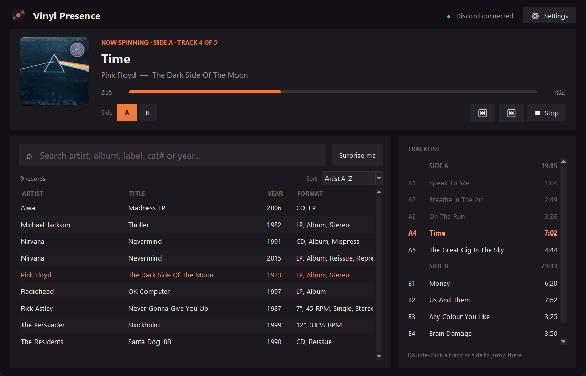

# Vinyl Presence

Spotify-style Discord status for the records on your real turntable.

Pick the record you just put on in a small desktop window. Your Discord profile then shows the album
cover, the track, the artist and a progress bar that moves through each side, so everyone can see you're
spinning actual vinyl:

> **Listening to My Record Player**
> Time
> Pink Floyd
> The Dark Side Of The Moon · Side A · on vinyl



- **Your own collection:** import the CSV export of your [Discogs](https://www.discogs.com) collection.
- **Fast search:** type a few letters of the artist, album, label, catalog number or year and press
  Enter. Small typos are fine.
- **Sides and tracks:** it knows each side's tracklist and track lengths, moves to the next track by
  itself, and asks you to flip the record when a side ends.
- **A normal Windows app:** nothing to host, no account, no server.

## Download

1. Download **`VinylPresence.exe`** from the [latest release](https://github.com/Y0ghurty/vinyl-presence/releases/latest).
2. Double-click it. The app isn't code-signed, so Windows may say *"Windows protected your PC"*: click
   **More info → Run anyway**.

Your settings, play history and cached covers are stored in `%APPDATA%\Vinyl Presence`. When a new
version comes out, the app shows *Update available* at the top.

## One-time setup (about 5 minutes)

1. **Create a Discord application.** Discord uses it for Rich Presence. It is not a bot.
   - Go to the [Discord Developer Portal](https://discord.com/developers/applications) → **New Application**.
   - Its name is the title of your status ("Listening to *name*"). Make it say you're using a turntable,
     like `My Record Player`.
   - Copy the **Application ID** from *General Information*.
2. **Upload the vinyl badge** (recommended). In your application, go to **Rich Presence → Art Assets**.
   Scroll down to *Rich Presence Assets* (not the Invite Image), click **Add Image(s)**, upload
   `vinyl.png`, name it `vinyl` and save. *Settings → Show vinyl.png* in the app shows you where the
   file is. It puts a small record on the album cover ("Spinning on my turntable").
3. **Export your collection** on Discogs: *Collection → Export → Download* the CSV.
4. **Start Vinyl Presence.** Settings opens on the first run. Paste the Application ID, click
   *Import Discogs CSV…* and choose your export, then click **Save**. The dot in the top right turns
   green: *Discord connected*.
5. In Discord, make sure *User Settings → Activity Privacy → Share your detected activities with others*
   is on.

## Using it

- Start typing to search. **Enter** plays the top result, **↑ ↓** pick another one, **Esc** clears.
  *Surprise me* picks a random record.
- It starts at side A. Click **B**, **C**, and so on when you put on another side, or double-click any
  track if you dropped the needle somewhere else.
- When a side ends, the app asks **Flip the record?**. You can also have it continue automatically.
- Click **Stop** when you're done. Closing the window also clears your status. If you forget, the status
  clears itself 10 minutes after the last side ends, or after an hour when track lengths are unknown.

When the track lengths are known, your status shows the current track with a progress bar. When they
aren't, it shows the album with an elapsed timer.

## Settings

| Setting | What it does |
|---|---|
| Card title | The top line of your status: your app's name (default), the artist, the album, or your own text |
| Member list shows | What appears after "Listening to" in server member lists: the artist, the track/album, or the card title |
| "View on Discogs" button | Adds a button to your status that links to the release |
| Vinyl badge asset name | The art asset from setup step 2 |
| Discogs token | Optional. Discogs allows more lookups per minute with it ([get one](https://www.discogs.com/settings/developers)) |
| Continue with the next side | Flip automatically after *n* seconds instead of waiting for you |
| Import Discogs CSV | Load a newer export after you buy records |

## What goes online

- **Discord:** the app talks to the Discord app on your own PC, the same way games do.
- **Discogs and Deezer:** to look up each record's cover, tracklist and track lengths (vinyl entries on
  Discogs usually have no lengths). Each record is looked up once, and the results are cached.
- **GitHub:** checks once per start whether a newer version is out.

Your collection and history never leave your PC.

## Run from source

You need [Python](https://www.python.org/downloads/) 3.10 or newer.

```bash
git clone https://github.com/Y0ghurty/vinyl-presence.git
```

Then double-click `start.bat`, or run `pythonw app.py`. When you run it from source, settings and data
are kept in the project folder, and you can also drop your Discogs CSV in there instead of importing it.

| File | What it does |
|---|---|
| `app.py` | The window |
| `core.py` | Collection, search and the player (sides, tracks, timers) |
| `metadata.py` | Looks up covers and tracklists (Discogs, Deezer) |
| `discord_ipc.py` | Talks to the Discord app |
| `version.py` | Version number, set automatically for releases |

## Publishing a new version

Push a tag:

```bash
git tag v1.1.0
```

```bash
git push origin v1.1.0
```

GitHub Actions then builds `VinylPresence.exe` and publishes it as a release with automatic release
notes (see `.github/workflows/release.yml`). Everyone running an older version sees *Update available*.

## Troubleshooting

- **"Discord isn't running"**: start the Discord desktop app. The browser version of Discord can't show
  Rich Presence. The app reconnects by itself.
- **"Discord rejected the Application ID"**: copy the *Application ID*, not the public key or the
  client secret.
- **No vinyl badge**: check that the image in *Rich Presence Assets* is named exactly `vinyl`. New images
  can take a few minutes to work.
- **Something else**: look in `data\log.txt` (in `%APPDATA%\Vinyl Presence` for the exe).

## License

[MIT](LICENSE)
